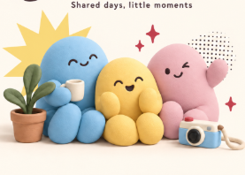

# Stewardie — UI and Asset Plan

Updated: September 21, 2026  
Platform: Flutter mobile, iOS and Android  
User-selected product name: Stewardie; commercial name clearance pending.  
Status: design specification for review; screens and production assets are not implemented.

Implementation note (September 22, 2026): the [first local demo slice](demo-foundation.md) implements Today, task detail, person filtering, and mood check-in with reviewed widget renders. Production artwork and the remaining screen scope below are still outstanding.

## 1. Source of truth

- [Product plan](shared-spaces-product-plan.md): feature behavior, scope, membership, and sharing rules.
- [Technical and launch plan](technical-launch-plan.md): proposed backend, account/age policy, media/location handling, and execution milestones. Pending choices are not yet final UI requirements.
- This document: navigation, screen hierarchy, interactions, visual direction, and asset requirements.
- [Earlier brand draft](kalinga-brand-plan.md): historical reference. Its family-only positioning, teal palette, and proposed logo are superseded by the shared-space direction and palette here.

The approved direction is minimal and cute, mixing soft clay 3D with restrained pop-art graphics. It serves families, housemates, dormmates, friends, and small crews. The app should feel welcoming across age groups.

## 2. Accepted art direction: Soft Pop

Keep the sky-blue, butter-yellow, and soft-pink characters from the user's selected reference. Use chalk and cream surfaces, electric-blue interface accents, and charcoal text and faces.



This reference establishes character shapes, expressions, material, and colors. Its red sparkles, brown pot, and baked-in typography do not establish the final interface palette. Replace decorative red accents with electric blue. Any retained natural object colors remain local to artwork.

### Visual rules

- Clay subjects: rounded, matte, softly textured, diffuse upper-left lighting, gentle contact shadows.
- Character trio: sky blue, butter yellow, soft pink. Keep proportions and faces consistent across poses.
- Pop-art layer: flat electric-blue halftone patches, butter-yellow starbursts, small sparkles, selective sticker borders.
- Flat 2D interface: clean surfaces, simple vector controls, restrained borders. Do not make every card or button look like a clay object.
- Keep busy screens mostly neutral. Large artwork belongs on welcome, invitation, and empty-state screens.
- Never place text over halftone patterns or detailed illustrations. Reserve a clear text area.
- Member photos and shared moments become the main visual content during normal use.
- No acid yellow, cherry-red decoration, cocoa text, rainbow dashboards, or heavy comic outlines around every component.

### Proposed color tokens

These hex values are implementation starting points, not sampled color guarantees from the reference image.

| Token | Value | Use |
|---|---|---|
| `canvas` | `#F5F3ED` | Warm chalk background |
| `surface` | `#FFFFFF` | Cards, forms, sheets |
| `surfaceWarm` | `#FFF7EB` | Selected illustration backdrops |
| `primary` | `#244BFF` | Primary buttons, selected tabs, focus and graphic accents |
| `onPrimary` | `#FFFFFF` | Text on primary buttons |
| `primarySoft` | `#E9EDFF` | Selected chip background |
| `text` | `#202633` | Main copy and faces |
| `textSecondary` | `#596171` | Supporting copy |
| `border` | `#DDDDE2` | Decorative separators; not the sole control boundary |
| `controlBorder` | `#777E8B` | Meaningful input/control boundaries where needed |
| `characterSky` | `#A9CDE8` | Sky-blue character and restrained member accents |
| `characterButter` | `#F5D76E` | Yellow character and starbursts |
| `characterRose` | `#EAB8C5` | Pink character and stickers |

Pastels carry dark text. Use labels and symbols alongside colors. Status treatments use check, clock, help, or warning icons with clear text; destructive actions use explicit wording and confirmation. The rejected decorative red palette does not prohibit an accessible platform error treatment when necessary. Measure final rendered contrast before implementation sign-off.

### Typography and geometry

- Nunito Sans: 400 body, 600 labels, 700 headings, 800 occasional welcome title. Use licensed font files with fallbacks.
- Screen title: 26–28 logical pixels; section heading: 18–20; body: 16; metadata: 14. Do not make essential information smaller to fit.
- Sentence case. Short, warm, direct copy.
- Base spacing: 4, 8, 12, 16, 24, 32. Start with 20 logical-pixel horizontal gutters.
- Card radius: 20; buttons and inputs: 14–16; member chips: capsule.
- Soft shadows only where useful for layering, not on every component.
- Light mode is the initial mockup direction. Dark mode is not yet designed.

## 3. Navigation and people separation

Three persistent bottom destinations: **Today / Moments / Space**. Each has a vector icon and visible text. Electric blue indicates selection, supported by icon or shape changes.

| Element | Behavior |
|---|---|
| Top space switcher | Switch between Home, Dorm 204, Weekend Crew, and other memberships |
| Today | Shared timeline, people filter, help requests, overview, week view |
| Moments | Space-scoped photos, task-linked moments, captions, reactions |
| Space | Members, invitations, routines, preferences, membership management |
| Inbox entry | Requests and relevant activity; label the originating space |
| Add action | Opens actions relevant to the current tab |

### People filters

Today contains one horizontally scrollable row: **Everyone / Me / Alex / Sam / Jo**. Me appears once and refers to the signed-in member. Each member chip shows avatar, name, and an optional small mood badge. Everyone is the default.

- Tapping a chip filters tasks and events; it does not open a profile or change account identity.
- Selection uses blue border/background plus a checkmark or equivalent shape cue.
- In a person's view, show entries they own or are requested to own, plus events they participate in. Show assignment status clearly.
- Shared events appear for each participant. Unclaimed tasks appear under Everyone.
- Provide “Find member” when the row becomes long.
- Open full member profiles through Space → Members. Do not give a small mood badge a competing tap target inside a chip.
- “Check in” is a separate visible action near the people row; it opens the current user's mood composer.
- Switching spaces clears any person filter that does not apply, dismisses previous-space private content, and updates all labels and composers.

## 4. Screen specification

### A. Welcome, account, and joining

Welcome uses one trio illustration, a short value statement, and Create a space / Join a space. Account entry supports returning users. Authentication method remains a backend decision.

Create flow: name → optional image → type/template → create → invitation options. Type examples adapt starter content without changing navigation.

Join flow: code input / link / QR scan → space preview → authentication if needed → join or request approval. Preserve a valid invitation through authentication. Preview only the permitted name and image.

Required states: invalid code, expired/revoked invitation, already a member, pending approval, declined request, camera denied, network unavailable. QR scanning has a code-entry alternative.

### B. Today

Screen order:

1. Space switcher and Inbox.
2. Date, Today title, and View week.
3. People-filter row and Check in action.
4. Compact counts: needs someone / covered / done.
5. Help-request card only when relevant; summarize multiple requests with View all.
6. Chronological task/event cards, with an Anytime group for untimed entries.
7. Completed group, collapsed when long.
8. Add button above the bottom navigation, respecting safe areas.

```text
Home crew v                            Inbox

Today                              View week
Monday, September 21

[Everyone] [Me] [Alex] [Sam] [Jo]  …
                              Check in
1 needs someone · 3 covered · 2 done

Sam could use a hand
Groceries                         Offer help

3:00 PM
Pick up supplies
Alex · Accepted                 Corner store

6:00 PM
Make dinner
You                                Mark done

                                       + Add
Today              Moments              Space
```

The wireframe communicates hierarchy only. Use real vector icons in finished UI. Avoid an oversized illustration above the task list.

Task cards show title, time, owner/requested owner, status, and optional place label. Decorative category icons stay secondary. Keep one primary action appropriate to state; put secondary actions in details.

Week view stays within Today, preserving the people filter. Provide a selected-day list below the calendar and a clear Back to today action.

### C. Task/event details and creation

Use a full detail screen for title, schedule, responsibility, notes, location, attachments, and short activity history. Create/edit uses labeled fields; progressively reveal repeat, reminders, and location options.

| State | Primary action / information |
|---|---|
| Unclaimed | I've got it |
| Requested of me | Accept; secondary Decline |
| Accepted by me | Mark done; secondary Need help |
| Help requested by another member | Offer help; retain existing owner until confirmed handoff |
| Transfer offered | Confirm handoff for the authorized participant |
| Completed | Done status; optional Add a photo |
| Pending sync | Clear local pending state; no confirmed remote claim |
| Someone else claimed first | Explain current owner and refresh available actions |

Completion immediately records the action locally, with sync status where relevant. Offer a nonblocking “Add a photo” follow-up. Do not require a camera step to finish.

### D. Mood check-in and member profile

Mood sheet: “How are you feeling?” → six labeled faces (Happy, Calm, Tired, Overwhelmed, Sad, Excited) → optional note → “Sharing with [space]” → Share check-in.

- Include Skip, update, and remove paths. Show expiry/current-day context.
- Labels remain visible; faces or colors never carry meaning alone.
- Keep “Could use a hand” separate from the mood choice. Let the person select a task if they want help.
- In another member's profile, show their current shared mood with time, their responsibilities, and their moments in this space only.
- No cross-space profile aggregation or emotional score.

### E. Moments

Chronological, space-scoped photo cards with author, time, caption, optional linked task, optional place label, and one appreciation action. Support Everyone and member filters without adding duplicate permanent navigation.

- Task photos reference their task; tapping opens the task detail.
- View on map appears only for an explicitly shared photo location.
- Opening a photo shows its aspect ratio, caption, capture/upload context, and location source where relevant.
- The author can remove their photo. Show permissions appropriately for other viewers.
- Add opens Take photo / Choose photo. A standalone moment can have an optional caption.
- Never show engagement rankings, public discovery, or unrelated spaces in this view.

### F. Camera and posting preview

Full-screen camera uses a stable shutter, camera switch, gallery entry, and close action. Keep controls recognizable and high contrast over the live preview.

Before capture, provide “Attach capture location” off by default. Enabling it requests location access and makes capture-time collection possible. Do not pretend a location requested after capture is the original capture location.

Preview contains photo, retake, optional caption, linked task if present, destination space, and attached location with Remove. Publish with Share photo.

- With capture-time location available, preview a fixed pin and timestamp.
- If no capture-time location exists, allow no pin; any future manually chosen place must be labeled Place tag, not Taken here.
- Gallery photos never inherit the uploader's present position as capture location.
- Upload states: preparing, uploading, waiting for connection, failed/retry, posted.
- Preserve the draft after a recoverable failure. Cancelling a photo does not undo a completed task.

### G. Location details and live sharing

Task location detail: place/address, entrance note, map, Get directions, and optional I'm here. This is a destination.

Photo location detail: photo thumbnail, fixed pin, time, and source/accuracy context. It is not a live position.

Live sharing: open from an event/task or Space → Location sharing → select 15/30/60 minutes → review space and recipient members → Start sharing.

- Map pins: destination pin, photo thumbnail pin, live avatar pin. Each has a distinct shape and readable detail label.
- A persistent active-session strip shows “Sharing with [space] · 12 min left · Stop.” It remains reachable when switching tabs or spaces.
- If multiple sessions are allowed, collapse into “Sharing in 2 spaces” and expose each audience and Stop action; never silently merge audiences.
- Recipient view shows updated time, stale states, and ended status. Hide expired positions.
- Offer a text/list alternative for essential map information.
- Offline stop state: “Stopped on this phone. Confirming with the space…” until acknowledged or expired. Stop local collection immediately.
- No permanently visible map on Today and no additional map tab in this navigation.

### H. Space, invitations, and settings

Space screen: small space illustration/image and name → member list → Invite members → routines → location sharing → notification preferences → settings.

Invite screen: readable code with Copy, Share link, scannable QR, expiration, optional approval setting. Owner controls revoke/regenerate. Explain that regeneration invalidates old invitations.

Member requests show approve/decline controls only to authorized owners. Membership removal and leaving a space clearly explain access consequences. Ownership transfer/deletion rules remain product decisions before implementation.

## 5. Reusable components

Space switcher; labeled bottom bar; member filter chip; mood badge; task card; help request card; daily summary; status pill; primary/secondary button; date/time/repeat input; moment card; reaction control; audience label; location chip; camera toolbar; upload status; active-location strip; invitation card; empty state; error/retry panel.

Each component needs default, pressed, focused, disabled, loading, selected where applicable, and failure states. Status is never communicated solely through opacity or color.

## 6. Asset inventory

**Current status:** only a visual reference/concept exists. All named production files below are proposed deliverables, not existing assets. Do not crop the concept board into final icons or UI components.

### Custom raster artwork

| ID / proposed filename | Count | Placement | Brief | Priority |
|---|---:|---|---|---|
| `clay-trio-welcome` | 1 | Welcome/create space | Blue, yellow, pink trio in the approved proportions | First mockup |
| `clay-trio-helping` | 1 | Invitation/help empty state | Same trio helping carry a small shared object | Next |
| `clay-trio-celebrating` | 1 | All caught up | Gentle celebration, small yellow star and blue sparkle | Next |
| `space-family-house` | 1 | Family template | Rounded cream house with blue accent | Next |
| `space-housemates-mugs` | 1 | Housemates/dorm template | Three mugs using the character palette | Next |
| `space-friends-picnic` | 1 | Friends template | Minimal picnic basket and shared objects | Next |
| `space-crew-toolbox` | 1 | Crew template | Friendly toolbox, simple contents | Next |
| `empty-today-calendar` | 1 | Empty Today | Small clay calendar and restrained starburst | First mockup |
| `empty-moments-camera` | 1 | Empty Moments | Cream/sky camera with blue accents | First mockup |
| `empty-members-invite` | 1 | Solo-member space | Two rounded tokens and an invitation card | Next |

Template objects can be deferred until core screens are validated. A neutral geometric space tile covers Custom without another large illustration.

### Custom vector artwork and reusable graphics

| Set | Count | Specification | Priority |
|---|---:|---|---|
| Mood faces | 6 | Happy, Calm, Tired, Overwhelmed, Sad, Excited; charcoal features; text labels provided in UI | First mockup |
| Default avatar tokens | 6 | Inclusive abstract faces/tokens; user photo or initials available | First mockup |
| Appreciation stickers | 4 | Heart, helping hands, star, thank-you motif; only heart/thanks interactive initially | Next |
| Pop-art accents | 4 | Halftone patch, yellow starburst, blue sparkle, selective sticker outline | First mockup |
| Map marker shells | 3 | Destination, photo-thumbnail holder, live-avatar holder | Location phase |

Create mood art in scalable vector form for small sizes. Do not infer mood from a person's avatar expression. Custom appreciation artwork should have no baked-in language; render labels in the interface.

### Standard functional icons

Use one Flutter-compatible, consistently rounded vector icon family. Select the library at implementation time and verify its license. Do not generate raster versions of navigation controls.

- Navigation/control: Today, Moments, Space, back, close, chevron, add, inbox, search, settings, more.
- Tasks/status: clock, check, repeat, calendar, reminder, help, handoff, edit.
- Media/location/invite: camera, camera switch, gallery, location pin, directions, live location, stop, link, copy, QR scan, share.
- Category set (12): groceries, cleaning, meals, errands, study, meetups, pickup/transport, appointment, medication reminder, pet care, supplies, other.

QR codes are generated dynamically from real invitation links. They are not decorative artwork and must be tested for scanning.

### User-supplied and dynamic content

Profile photos, space photos, shared moment photos, member initials, QR codes, map tiles, timestamps, labels, and notification counts are live content. Include neutral placeholders for mockups and missing images. Do not bake them into generated illustrations.

## 7. Asset production and handoff

Suggested future folder structure:

```text
assets/
  illustrations/clay/
  illustrations/spaces/
  illustrations/empty/
  vectors/moods/
  vectors/avatars/
  vectors/reactions/
  vectors/pop-accents/
  vectors/map-markers/
  fonts/
```

- Clay hero masters: approximately 2048 px long edge; object/empty-state masters: 1024 px square. Export only resolutions needed for final display sizes.
- Keep a high-quality PNG master; prefer genuine transparent backgrounds for isolated subjects and test edges on chalk and white. Deliver optimized PNG/WebP variants after visual comparison.
- Vector moods/avatars: 64×64 viewBox with simple geometry. Functional icons: 24-unit design grid with consistent stroke weight; map shells around 48 logical pixels before hit-area expansion.
- Keep shadows contained within padded artwork bounds. Avoid baked-in text, UI, large background panels, or stray colored fringes.
- Consistent naming: lowercase kebab-case, version suffixes for alternates. Preserve source masters, prompt/reference metadata for generated work, and license notes for fonts/icons.
- Record each asset's intended size, crop, background behavior, accessibility role, and screen placement in the eventual asset manifest.
- Decorative artwork has no screen-reader label. Meaningful image content needs an appropriate text alternative from its context.
- 3D renders are flat raster assets in the app; real-time 3D rendering is not required.

### Shared art brief

> Original soft clay artwork for a minimal shared-life mobile app. Use the selected sky-blue, butter-yellow, and soft-pink character trio with consistent rounded proportions, simple charcoal expressions, tactile matte surfaces, soft upper-left lighting, and gentle shadows. Add only a few crisp flat electric-blue sparkles/halftone details or butter-yellow starbursts. Keep the composition warm, clean, inclusive, and adult-friendly. For isolated assets, use a genuine transparent background, generous crop padding, and no text. Avoid red decorative accents, cocoa lettering, acid yellow, glossy plastic, excessive outlines, and dense collage.

Generate subjects separately, then compose them with live text and vector accents. Review all character poses against the same reference rather than inventing a new character design for each screen.

## 8. Accessibility, motion, and responsive behavior

- Maintain readable text contrast and meaningful control contrast, checked on the final colors and surfaces.
- Target at least 44 pt touch areas on iOS and 48 dp on Android; use generous controls around small visible icons.
- Support system text scaling, wrapping names, long translations, and screen-reader labels/states.
- Keep all actions accessible through visible buttons; swipes are optional shortcuts.
- Respect safe areas, keyboards, reduced motion, and landscape. Fixed bars must not obscure content.
- Start motion with short fades and subtle feedback around 150–220 ms; no persistent bouncing characters or pulsing mood indicators.
- Completion can show one short sparkle accent. Reduced motion uses a simple state change.
- Check small phones around 360–375 logical pixels and larger phone sizes. Adapt wide layouts without stretching text/cards indefinitely.
- Do not imply mood, location authenticity, or server confirmation through decoration.

## 9. Required state coverage for mockups

| Area | States to draw |
|---|---|
| Today | Populated, person-filtered, empty, loading, offline cached, pending completion |
| Responsibility | Unclaimed, awaiting acceptance, accepted, help requested, handoff confirmed, claim conflict |
| Mood | Not shared, composer, shared/current, removed/expired |
| Moments | Populated, empty, upload pending, upload failure, missing/removed photo |
| Invitation | Valid preview, invalid/expired, pending approval, already joined |
| Camera/location | Permission prompt context, denied, capture without pin, capture with pin, gallery upload |
| Live sharing | Audience review, active, stale, stopped, expired, offline stop confirmation |
| Space access | Solo member, multi-member, removed/no access |

## 10. Next design deliverables

1. Today (Everyone) and Today (one person selected), using realistic task density.
2. Task detail and completion-photo flow.
3. Mood sheet and Moments feed.
4. Space/member view and invite code/link/QR screen.
5. Map details and temporary-sharing flow.
6. Welcome/empty-state artwork integrated after the layout is readable.

The first visual review should validate hierarchy, member filtering, and the pastel-character/electric-blue balance. The selected name is Stewardie. Commercial name clearance, logo, dark mode, backend/map vendor, exact child-account controls, and production artwork remain unresolved. The name change preserves the approved Soft Pop art direction.
